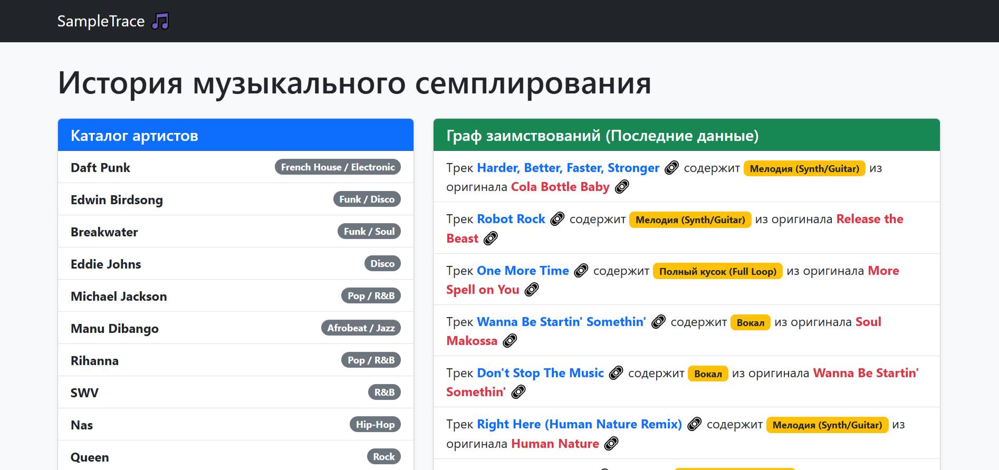
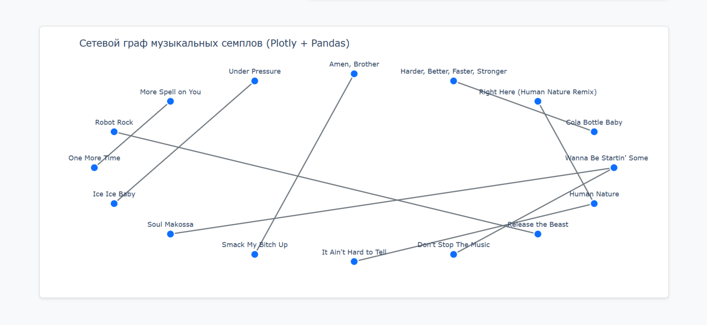

# SampleTrace: Аналитика музыкального семплирования

Веб-сервис для музыкальных продюсеров, диджеев и исследователей поп-культуры. Проект решает проблему поиска первоисточников звука, позволяя отслеживать цепочки заимствования (семплирования) между треками разных эпох. Система трансформирует сложные связи из базы данных в сетевой граф.

Ссылка на рабочий проект: [https://ваш-логин.pythonanywhere.com](https://ваш-логин.pythonanywhere.com) *(Примечание: обнови эту ссылку после деплоя)*

# Технологии
Backend: Python 3.10+, Django 6.0
Аналитика данных: Pandas (обработка датафреймов), NumPy (тригонометрические вычисления координат)
Визуализация: Plotly Graph Objects (генерация интерактивных HTML-графов)
Frontend: HTML5, Bootstrap 5 (адаптивная сетка и компоненты)
База данных: SQLite3 (Dev)

# Функционал
Динамический каталог: Фильтрация графа и списка треков по конкретному исполнителю через GET-запросы без сложной перезагрузки контекста.
Интерактивный граф Plotly: Автоматическое математическое распределение узлов (треков) на плоскости. Поддержка масштабирования и hover-эффектов.
Прямое прослушивание: Интеграция ссылок на внешние площадки (YouTube) для мгновенного сравнения оригинала и нового трека.

# Скриншоты интерфейса


*Каталог артистов и список заимствований с активными ссылками на прослушивание.*


*Сетевой граф Plotly, отображающий генеалогию семплов выбранного исполнителя.*

# Как запустить проект локально

1. Клонируйте репозиторий:
```bash
git clone [https://github.com/ВАШ-ЛОГИН/SampleTrace.git](https://github.com/ВАШ-ЛОГИН/SampleTrace.git)
cd SampleTrace